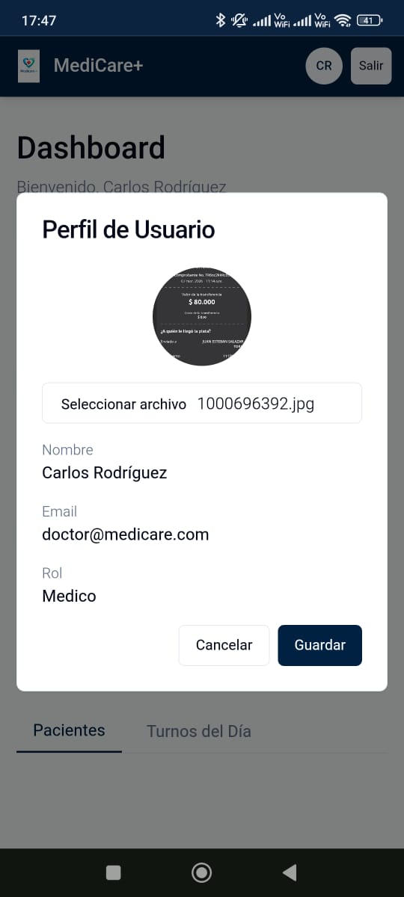
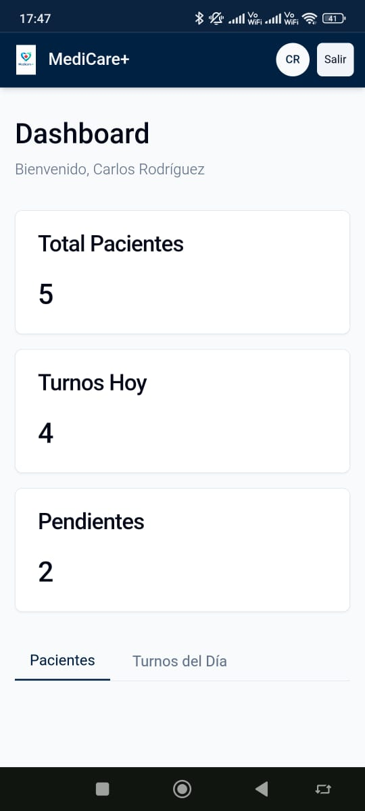
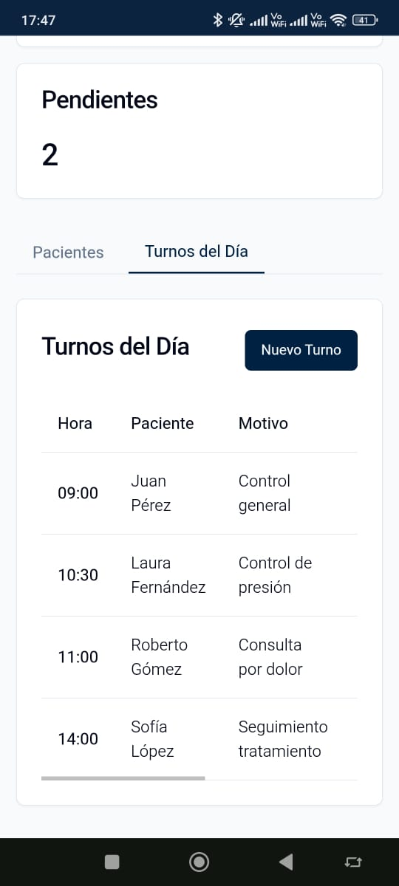
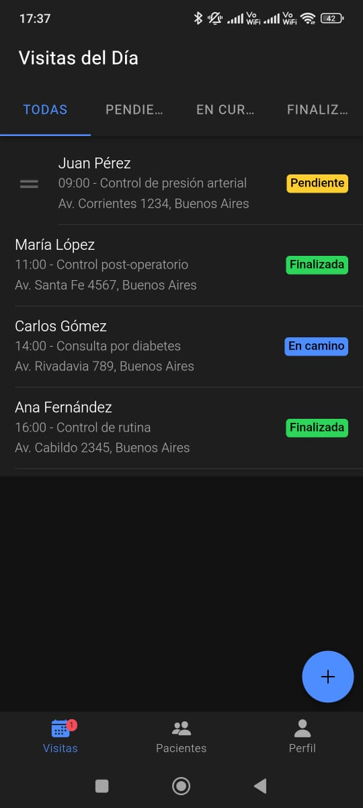
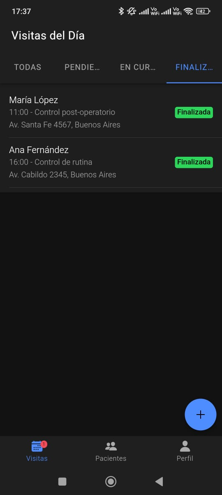
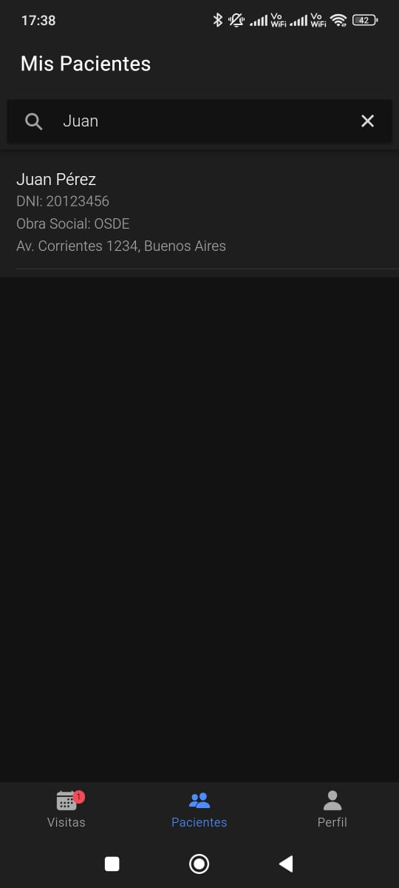
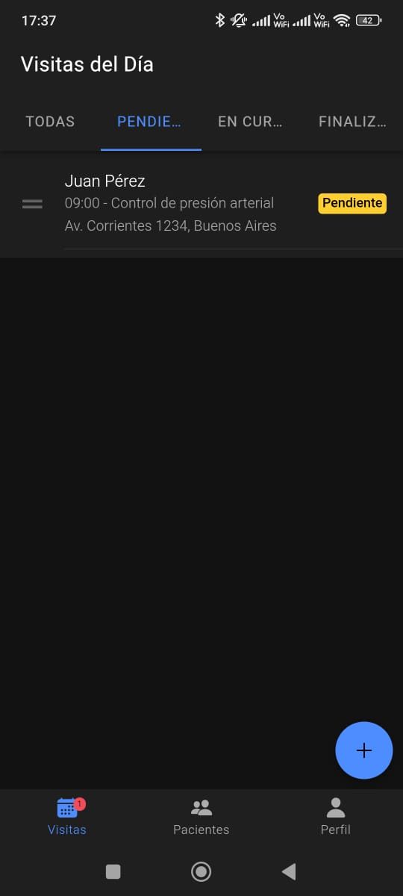
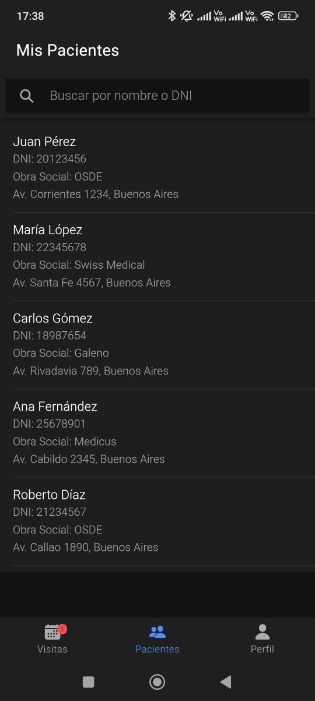

# MediCare+ — Parcial 1 Desarrollo Móvil

**Alumno:** Angel Del Castillo

Desarrollé dos aplicaciones para un sistema de gestión médica llamado MediCare+. Una es una PWA para el personal administrativo del consultorio y la otra es una app móvil para los médicos que hacen visitas a domicilio.

---

## PWA — Panel Administrativo

**Deploy:** [https://medicaredelcastillo.netlify.app/](https://medicaredelcastillo.netlify.app/)

La PWA está pensada para que el personal del consultorio pueda gestionar pacientes y turnos desde cualquier dispositivo con navegador, sin necesidad de instalar nada.

| Dashboard | Turnos del Día |
|-----------|---------------|
|  |  |

| Perfil de Usuario |
|------------------|
|  |

---

## App Móvil — Visitas a Domicilio (Ionic)

La app móvil es para los médicos. Desde acá pueden ver sus visitas del día, gestionar el estado de cada una y armar la receta médica directamente desde el celular.

| Visitas - Todas | Visitas - Pendientes | Visitas - Finalizadas |
|-----------------|----------------------|-----------------------|
|  |  |  |

| Mis Pacientes | Filtro Pendientes | Búsqueda de Paciente |
|---------------|---------------------|-------------------|
|  |  |  |

---
